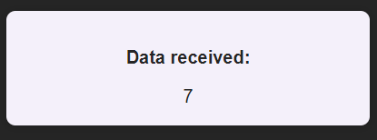
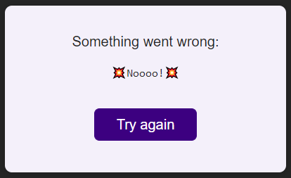
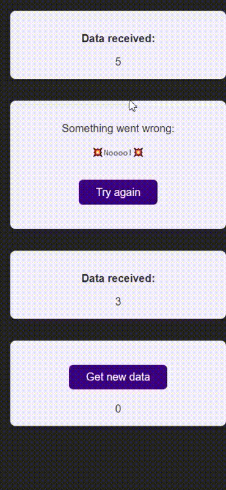

# `Error boundaries`

##  `1. for error in render jsx`
We have DataItem component that can have exception thrown on rendering.

Please, create DataList component. This component shoud render Dataitem 3 times. Each time it should be wrapped in error boundary, so that if exception will be thrown, error boundary will provide fallback ui. 
Fallback ui should be provided by ErrorFallback component. It should display message of thrown error and give an ability to retry creating DataItem component by clicking on 'Try again' button

 

##  `2*. for error in click handler`
Also, we have DataReceiver component, that can retrieve data on a button click, and sometimes exception can happen inside of this click handler. Fallback ui should be the same as in previous subtask:

general application behavior

## *Note: use React Error Boundary  for the solution*
